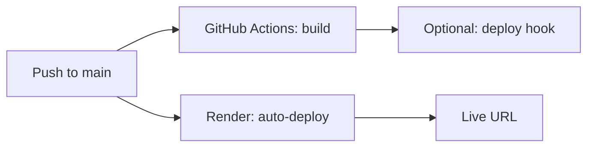

# Production deployment (no VPS required)

You do **not** need a VPS. Use **[Render](https://render.com)** (free tier): connect GitHub, set environment variables, and it runs your app on a public URL.

Pushing to **`main`** runs [`.github/workflows/deploy.yml`](../.github/workflows/deploy.yml) to **build and typecheck**. Render **hosts and runs** the app.

---

## One-time setup on Render (≈10 minutes)

### 1. Create a Render account

Sign up at [render.com](https://render.com) (GitHub login is fine).

### 2. Create a Web Service from your repo

1. **Dashboard → New + → Web Service**
2. Connect **GitHub** and select **`NotificationService`**
3. Use these settings:

| Setting | Value |
|---------|--------|
| **Root Directory** | `notification-service` |
| **Runtime** | Node |
| **Build Command** | `npm ci && npm run build` |
| **Start Command** | `npm start` |
| **Instance type** | Free |

4. **Branch:** `main`  
5. Turn **Auto-Deploy** ON (deploys on every push to `main`)

### 3. Add environment variables

In the service → **Environment**, add:

| Key | Example / notes |
|-----|------------------|
| `NODE_ENV` | `production` |
| `PORT` | `10000` (Render often sets this automatically; match their docs) |
| `API_KEY` | 32+ character random string |
| `SQLITE_PATH` | `./data/notifications.db` |
| `SMTP_HOST` | `smtp.gmail.com` |
| `SMTP_PORT` | `587` |
| `SMTP_SECURE` | `false` |
| `SMTP_USER` | your Gmail |
| `SMTP_APP_PASSWORD` | Gmail app password |
| `EMAIL_FROM_NAME` | `Notification Service` |
| `EMAIL_FROM_ADDRESS` | your Gmail |

Mark sensitive values as **Secret** in Render.

### 4. Deploy

Click **Create Web Service** (or **Manual Deploy**). When the build finishes, open the URL Render gives you, e.g. `https://notification-service-xxxx.onrender.com`.

### 5. Test

```text
GET https://YOUR-SERVICE.onrender.com/health
```

Use `api.http` with your Render URL and `x-api-key`.

---

## Optional: GitHub Actions deploy hook

Render can auto-deploy from GitHub without this. To also trigger deploy from Actions after CI passes:

1. Render → your service → **Settings → Deploy Hook**
2. Copy the hook URL
3. GitHub → **Settings → Secrets → Actions** → add `RENDER_DEPLOY_HOOK_URL`

---

## What you can ignore (no VPS)

- SSH keys (`deploy_key`, `SSH_PRIVATE_KEY`, etc.)
- PM2 / `ecosystem.config.cjs` (only for self-hosted servers)
- `mkdir ~/.ssh` on a Linux server

---

## SQLite on free hosting

On Render’s **free** plan, the filesystem is **ephemeral**: audit logs in SQLite may **reset** when the service redeploys or restarts. For production audit history long-term, later consider Render Disk (paid) or an external database.

---

## Deploy flow



---

## Local production test (Windows)

```powershell
cd notification-service
# fill .env locally — do not commit
npm run build
$env:NODE_ENV="production"
npm start
```

---

## Other hosts (alternatives)

| Platform | Notes |
|----------|--------|
| [Railway](https://railway.app) | Similar: connect GitHub, set env vars |
| [Fly.io](https://fly.io) | CLI deploy, small free allowance |
| VPS | Only if you want a server; use SSH + PM2 (old approach) |
